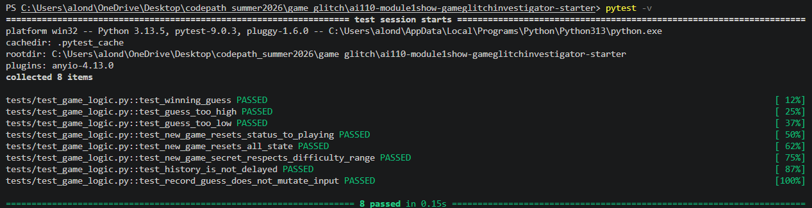

# 🎮 Game Glitch Investigator: The Impossible Guesser

## 🚨 The Situation

You asked an AI to build a simple "Number Guessing Game" using Streamlit.
It wrote the code, ran away, and now the game is unplayable. 

- You can't win.
- The hints lie to you.
- The secret number seems to have commitment issues.

## 🛠️ Setup

1. Install dependencies: `pip install -r requirements.txt`
2. Run the broken app: `python -m streamlit run app.py`

## 🕵️‍♂️ Your Mission

1. **Play the game.** Open the "Developer Debug Info" tab in the app to see the secret number. Try to win.
2. **Find the State Bug.** Why does the secret number change every time you click "Submit"? Ask ChatGPT: *"How do I keep a variable from resetting in Streamlit when I click a button?"*
3. **Fix the Logic.** The hints ("Higher/Lower") are wrong. Fix them.
4. **Refactor & Test.** - Move the logic into `logic_utils.py`.
   - Run `pytest` in your terminal.
   - Keep fixing until all tests pass!

## 📝 Document Your Experience

- [ ] Describe the game's purpose.The games purpose is to let the player guess a number depending the range of difficulty the player chose. When the player guesses the right number the player wins the game.
- [ ] Detail which bugs you found.
 I found three bugs within the game. One was the hints would lead the player in the wrong direction. The second bug I found was that it wouldnt let the player start a new game after a win or loss. The third bug I found was that the guess histroy was delayed by 1.
- [ ] Explain what fixes you applied.
for the first one we changed the logic of the if statments and took off the try and catch exception because it would change the guess into a string and would cause the error. The second bug we added new starting credentials so that the game starts with a clean slate. For the third one we moved the expander to be at the end of the block.

## 📸 Demo Walkthrough

Describe your fixed game in numbered steps so a reader can follow along without watching a video:

1. <!-- Describe this step -->
2. <!-- Describe this step -->
3. <!-- Describe this step -->
4. <!-- Describe this step -->
5. <!-- Add more steps as needed -->

**Screenshot** *(optional)*: <!-- Insert a screenshot of your fixed, winning game here -->

## 🧪 Test Results

## 🚀 Stretch Features

- [ ] [If you choose to complete Challenge 4, describe the Enhanced UI changes here — a screenshot is optional]
